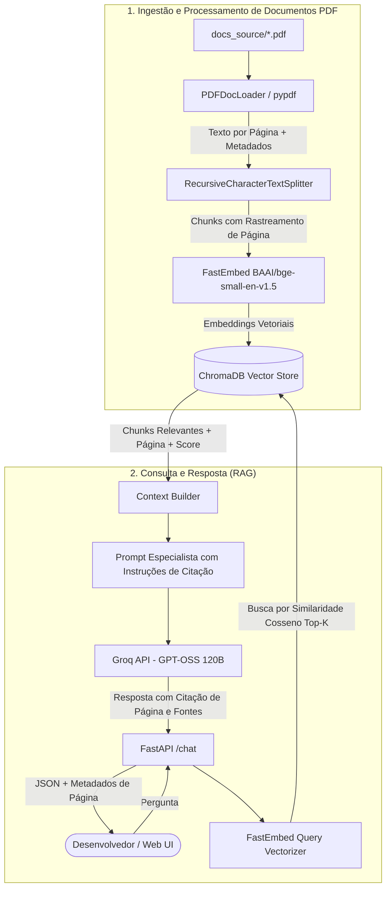
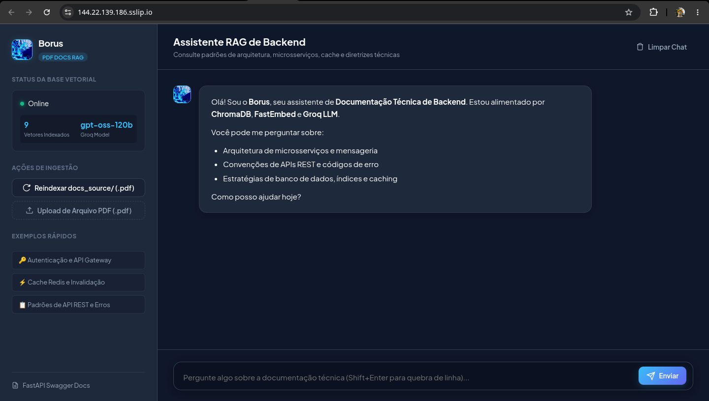
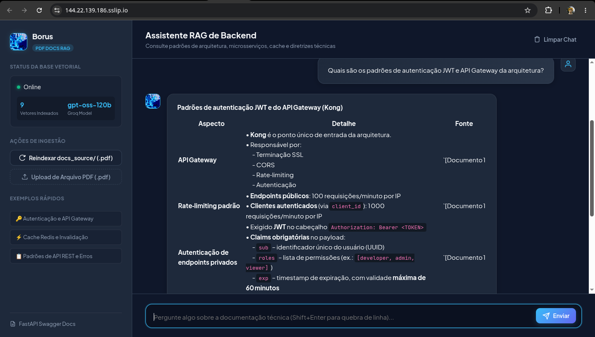
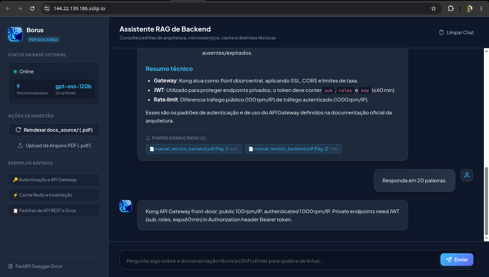

# 🚀 Borus — Assistente RAG de Documentação Técnica (PDF)

[](https://www.python.org/downloads/)
[](https://fastapi.tiangolo.com)
[](https://www.trychroma.com/)
[](https://groq.com/)
[](https://github.com/qdrant/fastembed)
[](https://pypdf.readthedocs.io/)
[](LICENSE)

O **Borus** é um agente inteligente de Geração Aumentada por Recuperação (RAG) desenvolvido para o **Challenge Alura Agente**. Ele é especializado em ler, processar e responder perguntas com precisão técnica a partir de **documentos em formato PDF**, citando explicitamente a página e o trecho de onde a informação foi extraída.

---

## Sumário

- [Arquitetura da Solução](#️-arquitetura-da-solução)
- [Estrutura do Projeto](#-estrutura-do-projeto)
- [Tecnologias Utilizadas](#️-tecnologias-utilizadas)
- [Exemplos de Perguntas e Respostas](#-exemplos-de-perguntas-e-respostas-do-agente)
- [Configuração do Ambiente (`.env`)](#️-configuração-do-ambiente-env)
- [Como Executar](#-como-executar)
  - [Opção 1: Docker Compose (Recomendado)](#opção-1-execução-com-docker-compose-recomendado)
  - [Opção 2: Python Virtualenv Local](#opção-2-execução-local-com-python-virtualenv)
  - [Ingestão e Upload de Novos PDFs](#-ingestão-e-upload-de-novos-pdfs)
- [Evidência do Deploy na OCI](#️-evidência-do-deploy-na-oci-oracle-cloud-infrastructure)
  - [Passos Realizados para o Deploy](#passos-realizados-para-o-deploy-na-oci)
  - [Informações do Deploy e Acesso HTTPS](#informações-do-deploy-na-oci)
  - [Capturas de Tela da Aplicação no Ar](#-capturas-de-tela-da-aplicação-no-ar-na-oci)
- [Testes Automatizados](#-testes-automatizados)
- [Licença](#-licença)

---

## 🏛️ Arquitetura da Solução



---

## 📂 Estrutura do Projeto

```text
borus/
├── app/
│   ├── __init__.py
│   ├── main.py              # Endpoints FastAPI (/chat, /health, /ingest, /stats) e SPA estática
│   ├── config.py            # Pydantic Settings e carregamento de variáveis de ambiente
│   ├── core/
│   │   ├── __init__.py
│   │   ├── loader.py        # PDFDocLoader: extração de texto página a página via pypdf
│   │   └── rag.py           # Pipeline RAG: FastEmbed, persistência no ChromaDB e Groq LLM
│   └── static/              # Interface Web moderna em SPA (Dark Mode, Markdown e Citações)
│       ├── index.html
│       ├── style.css
│       └── app.js
├── docs_source/             # Documentação técnica em PDF para ingestão inicial
│   └── manual_tecnico_backend.pdf  # Manual técnico com arquitetura, APIs, PostgreSQL e Redis
├── data/
│   └── chroma/              # Volume persistente do ChromaDB
│       └── .gitkeep
├── tests/                   # Suíte de testes automatizados com pytest
│   ├── __init__.py
│   ├── test_loader.py       # Testes unitários do leitor e chunker de PDF
│   └── test_api.py          # Testes de integração dos endpoints FastAPI
├── Dockerfile               # Multi-stage build enxuto, seguro (non-root) e com healthcheck
├── docker-compose.yml       # Orquestração do container com volumes persistentes
├── pyproject.toml           # Dependências do projeto (FastAPI, Groq, ChromaDB, pypdf, etc.)
├── .env.example             # Modelo de configuração de ambiente
├── .gitignore
├── LICENSE                  # Licença MIT
└── README.md                # Documentação técnica completa e entregáveis
```

---

## 🛠️ Tecnologias Utilizadas

- **Backend Framework**: [FastAPI](https://fastapi.tiangolo.com) 0.115+, [Uvicorn](https://www.uvicorn.org), [Pydantic v2](https://docs.pydantic.dev).
- **Leitura & Processamento de PDF**: [pypdf](https://pypdf.readthedocs.io) para extração nativa de texto e separação por página.
- **Divisão Semântica de Texto**: `langchain-text-splitters` (`RecursiveCharacterTextSplitter`).
- **Embeddings Locais**: [FastEmbed](https://github.com/qdrant/fastembed) (`BAAI/bge-small-en-v1.5`) executado via ONNX Runtime (rápido, leve e sem custo de tokens).
- **Banco Vetorial**: [ChromaDB](https://www.trychroma.com) com persistência local em disco (`data/chroma/`).
- **Modelo de Linguagem (LLM)**: [Groq Cloud](https://groq.com) com o modelo flagship open-weights `openai/gpt-oss-120b` (ou `openai/gpt-oss-20b`).
- **Interface Web**: Single Page Application (SPA) responsiva com Dark Mode, renderização Markdown via `marked.js`, destaque de sintaxe com `highlight.js` e pills com número de página e relevância.
- **Containerização**: Docker e Docker Compose com usuário não-root (`appuser`).

---

## 💡 Exemplos de Perguntas e Respostas do Agente

Abaixo estão exemplos reais de perguntas técnicas respondidas pelo **Borus** a partir do documento PDF indexado (`manual_tecnico_backend.pdf`):

### Exemplo 1: Autenticação e API Gateway
> **Pergunta**: *Como funciona a autenticação e quais são as claims obrigatórias do token JWT?*
> 
> **Resposta do Borus**:
> ```markdown
> A autenticação é gerenciada centralmente pelo **Kong API Gateway**. Endpoints protegidos exigem o envio do token no cabeçalho HTTP:
> 
> `Authorization: Bearer <TOKEN>`
> 
> As claims obrigatórias que devem constar no payload do JWT são:
> - `sub`: Identificador único do usuário em formato UUID.
> - `roles`: Lista de papéis e permissões associadas (ex: `["developer", "admin", "viewer"]`).
> - `exp`: Timestamp Unix de expiração com validade máxima de 60 minutos.
> 
> [Fonte: manual_tecnico_backend.pdf, Página 1]
> ```

---

### Exemplo 2: Estratégia de Cache e Invalidação
> **Pergunta**: *Qual é o padrão de cache utilizado para o Redis e qual é o TTL configurado para sessões e catálogo?*
> 
> **Resposta do Borus**:
> ```markdown
> O sistema utiliza o padrão **Cache-Aside (Lazy Loading)** com Redis 7:
> 
> 1. A aplicação consulta o Redis pela chave correspondente (latência < 2ms).
> 2. Em caso de *cache miss*, busca no PostgreSQL 16 e popula o Redis com TTL.
> 
> **Convenção de Chaves e TTLs:**
> - **Sessão / Token JWT**: Chave `auth:session:<session_id>` com TTL de **15 minutos (900s)**.
> - **Catálogo de Itens**: Chave `catalog:item:<sku>` com TTL de **2 horas (7200s)**.
> 
> **Invalidação**: Qualquer operação de escrita (`POST`, `PUT`, `DELETE`) executa uma invalidação síncrona imediata da chave no Redis (*Write-Through Invalidation*).
> 
> [Fonte: manual_tecnico_backend.pdf, Página 3]
> ```

---

### Exemplo 3: Padrão de Erros de APIs REST
> **Pergunta**: *Como devem ser formatadas as respostas de erro nas APIs REST?*
> 
> **Resposta do Borus**:
> ```markdown
> Todas as respostas de erro HTTP (4xx e 5xx) devem seguir obrigatoriamente a especificação **RFC 7807 (Problem Details)**:
> 
> ```json
> {
>   "type": "https://api.borus.com/errors/not-found",
>   "title": "Recurso Nao Encontrado",
>   "status": 404,
>   "detail": "O pedido com identificador ord_12345 nao foi localizado na base de dados.",
>   "instance": "/v1/pedidos/ord_12345"
> }
> ```
> 
> [Fonte: manual_tecnico_backend.pdf, Página 2]
> ```

---

## ⚙️ Configuração do Ambiente (`.env`)

Copie o arquivo `.env.example` para `.env` e configure sua chave da API Groq:

```bash
cp .env.example .env
```

| Variável | Descrição | Padrão |
| :--- | :--- | :--- |
| `GROQ_API_KEY` | Chave de API da [Groq Cloud](https://console.groq.com) | *(Obrigatório)* |
| `GROQ_MODEL` | Modelo Groq utilizado | `openai/gpt-oss-120b` |
| `EMBEDDING_MODEL` | Modelo de Embedding FastEmbed | `BAAI/bge-small-en-v1.5` |
| `CHROMA_PERSIST_DIRECTORY` | Caminho de persistência dos vetores | `./data/chroma` |
| `DOCS_SOURCE_DIR` | Pasta contendo arquivos `.pdf` para ingestão | `./docs_source` |
| `CHUNK_SIZE` | Tamanho máximo do chunk de texto (caracteres) | `600` |
| `CHUNK_OVERLAP` | Sobreposição entre chunks consecutivos | `80` |
| `TOP_K` | Quantidade de trechos mais relevantes recuperados | `4` |
| `APP_PORT` | Porta do servidor | `8000` |

---

## 🚀 Como Executar

> [!NOTE]
> **Auto-ingestão no Startup**: Ao iniciar o servidor (localmente ou via Docker), o Borus verifica se a base do ChromaDB está vazia (`total_vectors == 0`). Caso esteja, ele executa a ingestão e indexação automática de todos os arquivos `.pdf` contidos em `docs_source/`.

### Opção 1: Execução com Docker Compose (Recomendado)

```bash
# 1. Configure as variáveis de ambiente
cp .env.example .env
# Edite o .env e adicione sua GROQ_API_KEY

# 2. Garanta a criação da pasta de dados persistentes
mkdir -p data/chroma

# 3. Suba o container
docker compose up --build -d

# 4. Acompanhe os logs
docker compose logs -f
```

Acesse no navegador:
- **Interface Web**: [http://localhost:8000](http://localhost:8000)
- **Documentação Swagger (OpenAPI)**: [http://localhost:8000/docs](http://localhost:8000/docs)

---

### Opção 2: Execução Local com Python Virtualenv

```bash
# 1. Crie e ative o ambiente virtual
python3 -m venv .venv
source .venv/bin/activate

# 2. Instale o pacote e dependências
pip install --upgrade pip
pip install -e ".[dev]"

# 3. Configure as variáveis
cp .env.example .env

# 4. Inicie o servidor FastAPI
uvicorn app.main:app --reload --host 0.0.0.0 --port 8000
```

---

### 🔄 Ingestão e Upload de Novos PDFs

- **Pela Interface Web**: Use o botão **"Upload de Arquivo PDF (.pdf)"** na barra lateral.
- **Via cURL (Upload Multipart)**:
  ```bash
  curl -X POST "http://localhost:8000/ingest/upload" \
    -F "file=@/caminho/do/seu/documento.pdf"
  ```
- **Reindexar pasta `docs_source/`**:
  ```bash
  curl -X POST "http://localhost:8000/ingest"
  ```

---

## ☁️ Evidência do Deploy na OCI (Oracle Cloud Infrastructure)

Este projeto foi preparado para execução em instâncias de computação da **Oracle Cloud Infrastructure (OCI)**.

### Passos Realizados para o Deploy na OCI:
1. **Provisionamento da Instância Compute na OCI**:
   - Criação de uma instância Linux (Ubuntu 24.04 Minimal LTS).
   - Alocação de IP Público Reservado.
2. **Configuração de Regras de Entrada (VCN Security List & Ingress Rules)**:
   - Adicionadas regras de Ingress no Security List da Virtual Cloud Network (VCN):
     - **Portas 80 e 443 (TCP)**: Abertas publicamente para o **Caddy** (HTTPS com certificado automático Let's Encrypt).
     - **Porta 8000**: Mantida **isolada** na rede interna do Docker (`borus-network`), sem exposição pública direta.
3. **Instalação do Docker e Inicialização**:
   ```bash
   sudo apt-get update && sudo apt-get install -y docker.io docker-compose-v2
   git clone https://github.com/soneylegal/borus-challenge-one.git
   cd borus-challenge-one
   cp .env.example .env
   # Configurar GROQ_API_KEY no .env
   mkdir -p data/chroma
   docker compose up --build -d
   ```

### Informações do Deploy na OCI:
- **Link Público da Aplicação (HTTPS)**: [https://144.22.139.186.sslip.io](https://144.22.139.186.sslip.io)
- **Documentação Swagger (OpenAPI)**: [https://144.22.139.186.sslip.io/docs](https://144.22.139.186.sslip.io/docs)
- **Proxy Reverso & Segurança**: Caddy 2 com TLS automático gerenciando o tráfego externo e roteando para `borus:8000` internamente.

### 📸 Capturas de Tela da Aplicação no Ar na OCI:

#### 1. Interface Inicial com Conexão Segura HTTPS e 9 Vetores de PDF Indexados


#### 2. Resposta Estruturada com Tabela e Citação de Página do PDF ([Documento 1, p. 1])


#### 3. Detalhamento de Fontes Consultadas com Score de Similaridade e Resposta Concisa


---

## 🧪 Testes Automatizados

Para executar os testes unitários do leitor de PDF e rotas da API:

```bash
pytest -v
```

---

## 📄 Licença

Distribuído sob a licença **MIT**. Consulte o arquivo [LICENSE](LICENSE) para mais detalhes.

© 2026 Davi Laurindo